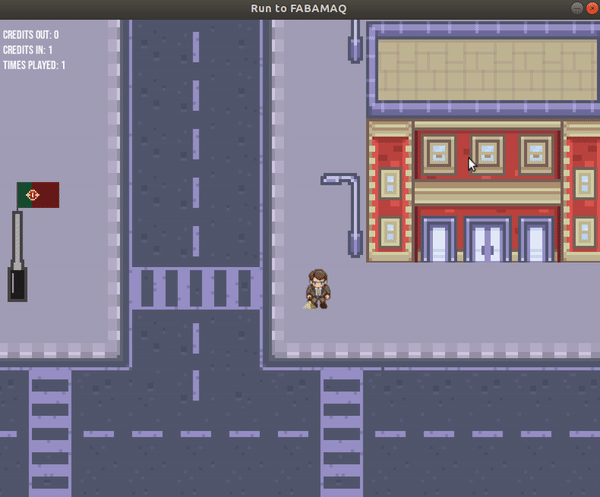

# Game Development Challenge 🕹
Repositório criado para minha aplicação na FMQ. 
"Run to FABAMAQ" é um Mini Game desenvolvido em C++ utilizando a biblioteca SDL. Foi criada uma Engine própria e do zero.
O objetivo do jogo é ajudar o personagem "Guilherme" a chegar no seu futuro trabalho na "FABAMAQ". Porém, faça com que o personagem não contraia a COVID-19 no caminho. 
Conto com a sua ajuda! 👨‍💻 #BuildEngineFromScratch



# Pré-requisitos

💻SO:
  - Linux (Ubuntu);

📚Biblioteca SDL

⚙Compilador C++

# Compilador g++

1. Instalar o compilador g++ no seu Ubuntu:

`$ sudo apt install g++`
  
2. Checar se o mesmo foi instalado corretamente:

`$ g++ --version`

# Biblioteca SDL
Simple DirectMedia Layer (SDL) é uma biblioteca multimídia livre e de código aberto, multiplataforma, escrito em C que representa uma interface simples para gráficos, som, e dispositivos de entrada de várias plataformas. 

1. Instalar a Biblioteca SDL:

`$ sudo apt-get install libsdl2-2.0`

2. Instalar Extensões:

- SDL2_image
`$ sudo apt-get install libsdl2-image-dev`

- SDL2_ttf
`$ sudo apt install libsdl-ttf2.0-0 `

# Compilar
1. Acessar o diretório "Source" pelo Terminal

2. Executar todos arquivos .cpp, conforme abaixo:

```console
foo@bar:~$ $ g++ AssetManager.cpp Collision.cpp ECS.cpp Game.cpp main.cpp Map.cpp TextureManager.cpp Vector2D.cpp `sdl2-config --cflags --libs` -w -lSDL2 -lSDL2_image -lSDL2_ttf -o run
```

# Instruções
```console
foo@bar:~$ whoami
foo
```


# Agradecimentos
Ao Tiago Gomes e todo time da FMQ que me possibilitaram essa oportunidade.
